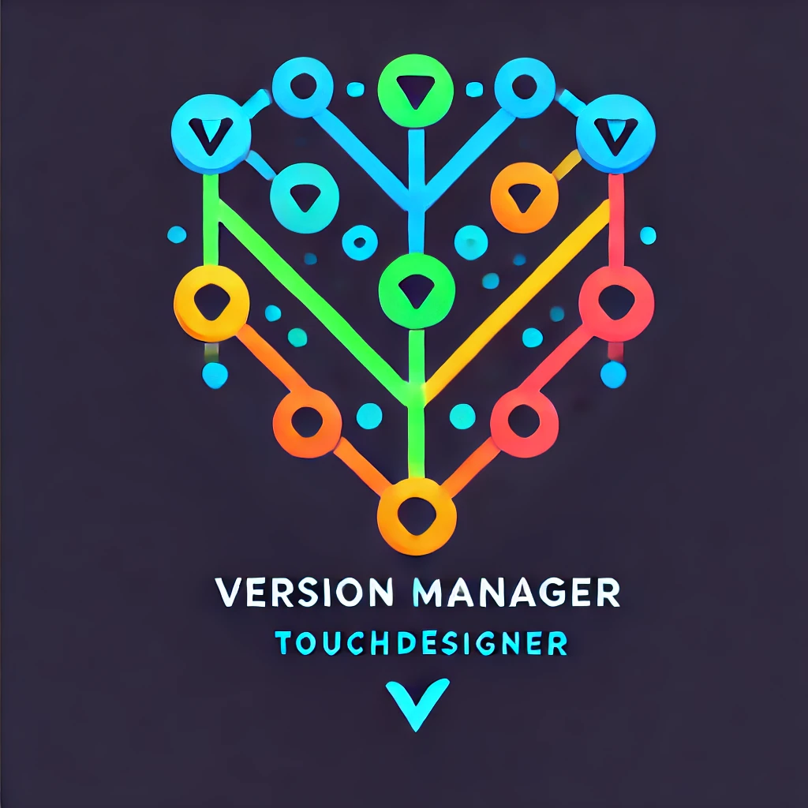

#  Mariana

**Mariana** is an innovative version control system (VCS) tailored specifically for **TouchDesigner** projects, designed to overcome the limitations of traditional version control tools. Built with **Electron**, **React**, and **TypeScript**, it offers a seamless, user-friendly experience for managing complex multimedia and interactive projects.

## Table of Contents

- [Introduction](#introduction)
  - [Why Mariana?](#why-mariana)
  - [Why Choose Mariana for TouchDesigner?](#why-choose-mariana-for-touchdesigner)
- [Features](#features)
- [Project Setup](#project-setup)
    - [Installation](#installation)
    - [Development](#development)
    - [Building for Production](#building-for-production)
- [Infra Setup](#infra-setup)
- [Troubleshooting](#troubleshooting)

## Introduction

### Why Mariana?

Version control systems have revolutionized collaborative development in the software industry, enabling efficient management of changes, clear project evolution, and traceability. However, existing tools like **Git** excel only with plain text files, leaving users working with **opaque binary files** (e.g., `.toe` files in TouchDesigner) without robust solutions.

**Mariana** bridges this gap. It empowers TouchDesigner users to:
- **Collaborate Effortlessly**: Simplify teamwork by managing concurrent changes and offering version merging tools.
- **Visualize Changes**: See project evolution with clear visualizations and metadata for each version.
- **Preview Project States**: Access previews of specific versions without needing to open TouchDesigner.
- **Navigate Versions Easily**: Quickly move between versions and identify differences, saving time and reducing errors.

### Why Choose Mariana for TouchDesigner?

**TouchDesigner**, a powerful tool for creating interactive multimedia, lacks a comprehensive version control solution. Current alternatives are either limited (e.g., TouchDesigner's own basic versioning) or too generic (e.g., Git, which struggles with binary files). Mariana is purpose-built to handle the unique requirements of TouchDesigner projects, offering features like:
- **Version Comparison**: Understand what changed between versions, even for binary files.
- **Concurrent Editing**: Manage edits from multiple collaborators with ease.
- **User-Friendly Design**: A modern, intuitive interface tailored to the needs of TouchDesigner users.

## Features

- **Optimized for TouchDesigner**: Built with a focus on the unique needs of TouchDesigner projects.
- **Cross-Platform**: Runs seamlessly on Windows and macOS.
- **Electron and React**: Leverages modern web and desktop technologies for performance and usability.
- **Tailwind CSS**: Provides clean, responsive UI design.
- **GCP-Backed Infra**: Mariana's remote versioning capabilities are supported by Gitea hosted on GCP infrastructure. Details in the [infra README](infra/README.md).

## Project Setup

### Installation

Install the project dependencies:

```bash
npm install
```

### Development

Start the application in development mode with hot-reloading:

```bash
npm run dev
```

### Building for Production

Build the application for your platform:

- **Windows**:

  ```bash
  npm run build:win
  ```

- **macOS**:

  ```bash
  npm run build:mac
  ```

### Additional Scripts

- **Run Tests**: Execute the test suite using Jest:
  ```bash
  npm run test
  ```

- **Format Code**: Automatically format code using Prettier:
  ```bash
  npm run format
  ```

- **Lint Code**: Lint and fix issues:
  ```bash
  npm run lint
  ```

- **Type Check**: Validate TypeScript code:
  ```bash
  npm run typecheck
  ```

## Infra Setup

Mariana's GCP-based infrastructure is managed through Terraform configurations. Full details are available in the [infra README](infra/README.md).

### Quick Access to Infra README:

- Navigate to the [infra directory](infra).
- Follow the setup instructions in the `README.md` to deploy Gitea and supporting resources on GCP.

## Troubleshooting

### Common Issues

- **Dependency Errors**:
    - Ensure dependencies are installed with `npm install`.
    - Verify the correct versions of Node.js and npm are installed.

- **Development Server Issues**:
    - Check if ports are already in use and resolve conflicts.
    - Ensure Electron is installed globally if errors occur during startup.

### Logs and Debugging

To debug runtime issues, start the app in development mode:

```bash
npm run dev
```
