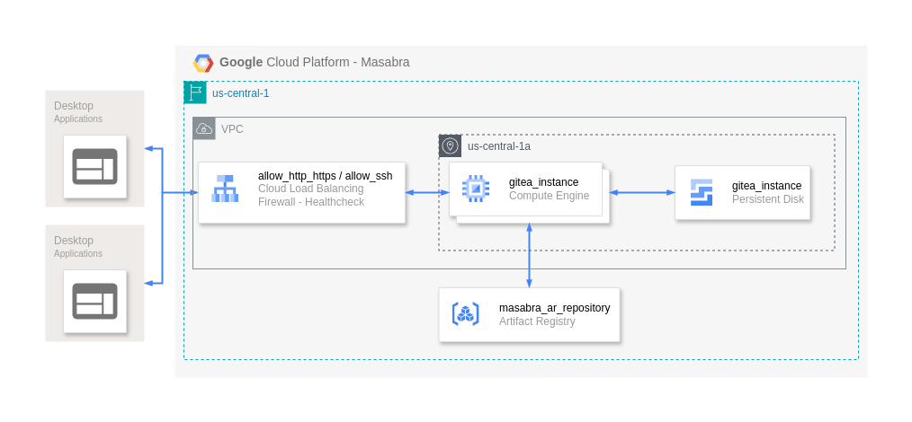

# Masabra: Mariana's GCP Infraestructure.

## Introduction

This repository contains the Terraform configurations for deploying the backend services for Mariana's remote versioning capabilities. [Gitea](https://gitea.io/en-us/) is used as a lightweight, self-hosted Git service.

## Table of Contents

-   [Architecture Overview](#architecture-overview)
-   [Prerequisites](#prerequisites)
-   [Setup Instructions](#setup-instructions)
    -   [1. Configure Variables](#1-configure-variables)
    -   [2. Initialize Terraform](#3-initialize-terraform)
    -   [3. Apply Terraform Configuration](#4-apply-terraform-configuration)
-   [Accessing Gitea](#accessing-gitea)
-   [Destroying the Infrastructure](#destroying-the-infrastructure)
-   [Troubleshooting](#troubleshooting)
-   [Setting Up the gcloud SDK](#setting-up-the-gcloud-sdk)
-   [Applying Custom Changes from the Original Gitea Repository](#applying-custom-changes-from-the-original-gitea-repository)
-   [Deploy to the Artifact registry](#deploy-to-the-artifact-registry)

## Architecture Overview



The Terraform scripts provision the following resources on GCP:

-   **Compute Engine Instance**: Virtual machine running Gitea.
-   **VPC Network**: Virtual Private Cloud network for the instance.
-   **Load Balancer**: Basic load balancing components, including a health check, backend service, URL map, HTTP proxy, and forwarding rule.
-   **Firewall Rules**: Allow HTTP (port 80, 443) and SSH (port 22) access.
-   **External IP Address**: Public IP to access Gitea over the internet.
-   **Disk Storage**: Persistent disk for data storage.

## Prerequisites

Before starting, ensure you have:

-   A GCP account with project-level access.
-   [`terraform >= 1.9.8`](https://www.terraform.io/downloads.html).
-   [`gcloud >= 497.0.0`](https://cloud.google.com/sdk/docs/install) installed and configured.

## Setup Instructions

### 1. Configure Variables

Edit the `variables.tf` file or create a `terraform.tfvars` file to customize the deployment. Key variables include:

-   **Project Settings**:

    -   `project_id`: Your GCP project ID.
    -   `region`: GCP region for resource deployment.
    -   `zone`: GCP zone within the region.

-   **Instance Settings**:

    -   `machine_type`: Compute Engine instance type (e.g., `e2-medium`).
    -   `instance_name`: Name of the Gitea VM instance.

-   **Network Settings**:

    -   `network_name`: Name of the VPC network.
    -   `subnet_name`: Name of the subnet.

-   **Gitea Settings**:
    -   `gitea_port`: Port on which Gitea will run (default is `3000`).
    -   `gitea_admin_username`: Admin username for Gitea.
    -   `gitea_admin_password`: Admin password for Gitea.
    -   `gitea_db_password`: DB password for the PostgreSQL DB that gitea will use.

**Example `terraform.tfvars` file:**

```hcl
project_id           = "your-gcp-project-id"
region               = "us-central1"
zone                 = "us-central1-a"
machine_type         = "e2-medium"
instance_name        = "gitea-instance"
network_name         = "gitea-network"
subnet_name          = "gitea-subnet"
gitea_port           = 3000
gitea_admin_username = "admin"
gitea_admin_password = "strongpassword"
gitea_db_password    = "your-secure-password"
repository_id        = "ar-repository-id"
```

### 3. Initialize Terraform

Initialize the Terraform working directory to download necessary providers and modules.

```bash
terraform init
```

### 4. Apply Terraform Configuration

Review and apply the Terraform plan to create resources.

```bash
terraform plan
terraform apply
```

Type `yes` when prompted to confirm the operation.

## Accessing Gitea

1. **Retrieve the External IP Address**:

    ```bash
    terraform output gitea_instance_ip
    ```

2. **Access Gitea Web Interface**:

    Open your web browser and navigate to `http://<GITEA_IP_ADDRESS>:80` / `http://<GITEA_IP_ADDRESS>`.

3. **Log In**:

    Use the admin credentials specified in your `terraform.tfvars` file.

## Destroying the Infrastructure

To remove all resources created by Terraform:

```bash
terraform destroy
```

Confirm by typing `yes` when prompted.

## Troubleshooting

-   **SSH Access to VM**:

    ```bash
    gcloud compute ssh <instance_name> --project=<project_id> --zone=<zone>
    ```

-   **Firewall Issues**:

    Ensure firewall rules allow inbound traffic on ports `80` (HTTP/S) and `22` (SSH).

-   **Terraform Errors**:

    -   Make sure all required variables are set.
    -   Check for typos or incorrect values in your `terraform.tfvars` file. _(MIHTT: Man I Hate Terraforms Tfvars)_
    -   If you mess with the `tfstate` you get the lead. _((threat))_
    -   Make sure the GCP Compute api is turned on `compute.googleapis.com`.

## Setting Up the gcloud SDK

To interact with GCP resources, and depliy the infraestructure, ensure the Google Cloud SDK is installed and properly configured:

1. **Install the gcloud SDK**:

    - Download and install the SDK from the [official Google Cloud SDK documentation](https://cloud.google.com/sdk/docs/install).

2. **Authenticate with the Google Account**:
   Run the following command and follow the prompts to log in:

    ```bash
    gcloud auth application-default login
    ```

3. **Set the active project**:
   There are two ways to configure the project ID for your GCP project:

    1. Set up the project with the sdk helper:

        ```bash
        gcloud init
        ```

    2. Manually set up the project:
        ```bash
        gcloud config set project <your-project-id>
        ```
        It should be the same as the `project_id` environment variable.

    **Either one should work.**

4. **Verify your setup**:
   Check if your gcloud CLI is properly configured by listing active configurations:

    ```bash
    gcloud config list
    ```

    You should see your project, region, and zone correctly set.

5. **Enable required APIs**:

    > _**This step should not be done unless a new project is run, the API should already be initialized**_.

    Ensure the necessary APIs are enabled for your project:

    ```bash
    gcloud services enable compute.googleapis.com
    gcloud services enable artifactregistry.googleapis.com
    ```

6. **Test your connection**:
   Try listing your active compute instances to ensure everything is set up:

    ```bash
    gcloud compute instances list
    ```

    If your instance is listed, the SDK is ready for use.

## Applying Custom Changes from the Original Gitea Repository

To apply the changes needed from the original Gitea repository to achieve the version in [Masabra-gitea](https://github.com/BraveJero/Masabra-gitea), follow these steps:

### Step 1: Clone the Original Gitea Repository

Clone the original Gitea repository to your local machine:

```bash
git clone https://github.com/go-gitea/gitea.git
cd gitea
```

### Step 2: Download and Apply the Patch

1. **Download the Patch File**:
   Get the patch file (`/masabra-gitea-changes.patch`) that contains the custom changes. This file was generated based on commit `713364fc718d1d53840bd83ba6f6c307bd213fa8` from the main branch.

2. **Apply the Patch**:
   Use the `git apply` command to apply your changes to the cloned repository:

   ```bash
   git apply /masabra-gitea-changes.patch
   ```

3. **Verify the Patch**:
   After applying the patch, check that the changes have been applied successfully:

   ```bash
   git status
   ```

   If there are any conflicts, Git will highlight them. Resolve these conflicts manually.

### Step 3: Test the Updated Repository

Before deploying the updated Gitea repository, build and test it locally to ensure the changes work as expected:

```bash
make build
```

> Gitea has a lot of requirements, we recommend building a Docker image from the `Dockerfile` configuration.

### Step 4: Deploy the Updated Version

Use the deployment steps outlined in the [Deploy to the Artifact Registry](#deploy-to-the-artifact-registry) section to build and deploy the updated Gitea image to your GCP infrastructure.

### Troubleshooting

If you encounter issues while applying the patch:
- Ensure the patch file corresponds to the correct version of the original repository.
- Resolve any merge conflicts manually by editing the conflicting files.
- Use `git log` and `git diff` to debug and verify applied changes.

## Deploy to the Artifact registry

To deploy an image to the artifact registry follow these commands:

1. Set up `gcloud` to push to the corresponding docker pkg.

    ```bash
    gcloud auth configure-docker <var.registry_region>-docker.pkg.dev
    ```

    > The region in `<var.registry_region>` should be set to the correct region.

2. Build the image with a name.`image_name`

    ```bash
    docker build -t <image_name> .
    ```

3. Tag the image with the corresponding artifact registry location

    ```bash
    docker tag <image_name> <var.registry_region>-docker.pkg.dev-docker.pkg.dev/<var.project_id>/<ar_repository_name>/<image_name>
    ```

    > Remember to replace all `<vars>` with the corresponding values.

4. Push the tagged image to the remote docker registry
    ```bash
    docker push <var.registry_region>-docker.pkg.dev/<var.project_id</<output.ar_repository_name</<image_name>
    ```
